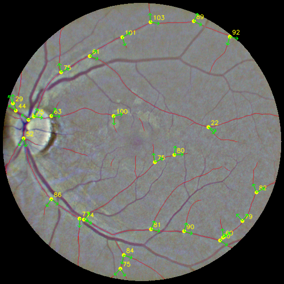
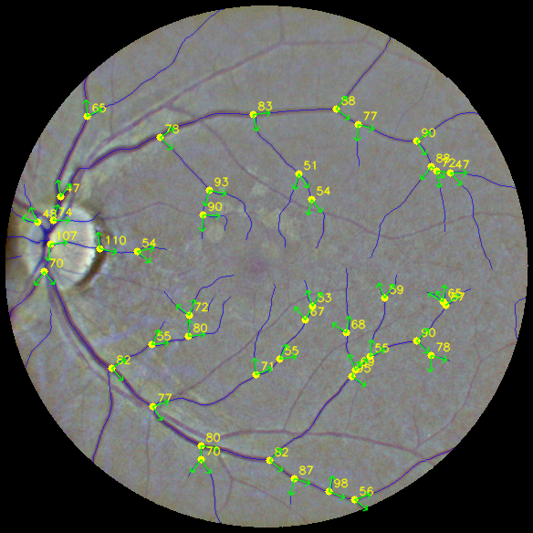
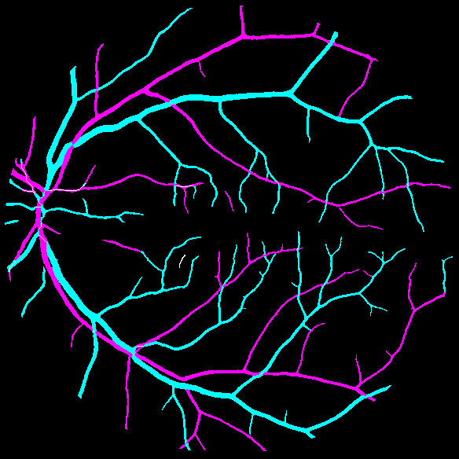
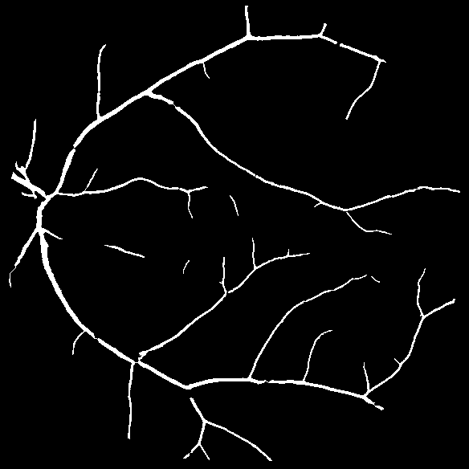
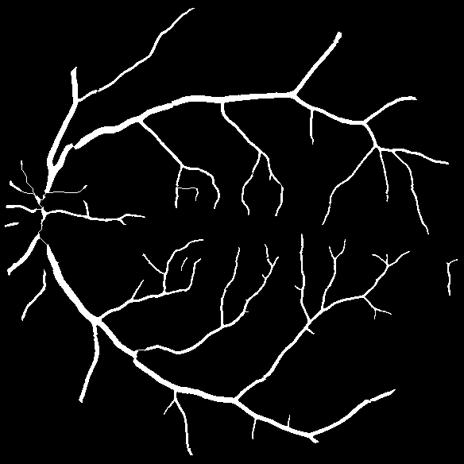
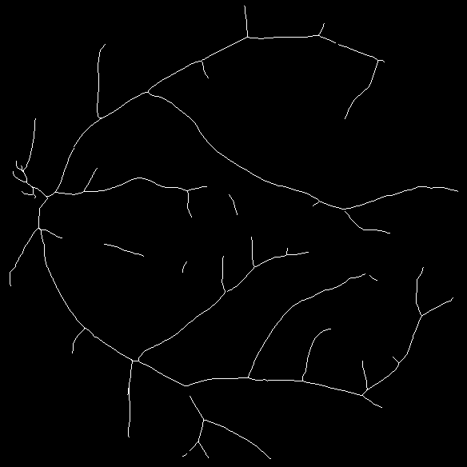
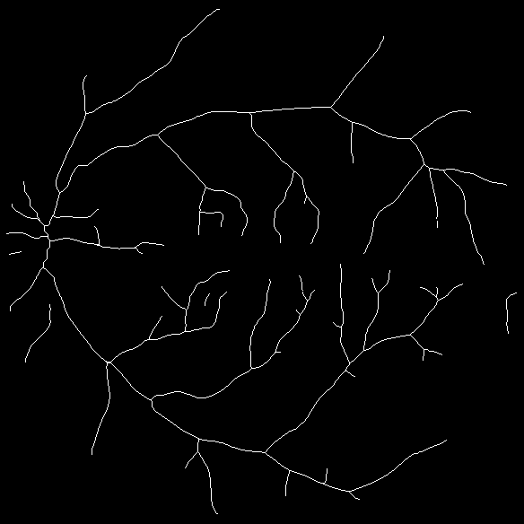

# RetiFlow

> Improved Retinal Branching Angle Detection

[](LICENSE)

**RetiFlow** is a **bifurcation angle detection** tool for retinal vessels. It
consumes vessel maps (probability maps, binary masks, or skeletons) and produces
bifurcation detections with angles and branch directions.

RetiFlow is **independent of any segmentation network** — it does not segment.
It only consumes vessel maps that you provide. The current results were tested
on probability maps produced by [RRWNet](https://github.com/j-morano/rrwnet),
but any upstream segmentation output works.

---

## Three Key Improvements

### 1. A/V maps measured separately
Arteries and veins are measured **independently**, not as a single vessel tree.
Each class gets its own bifurcation statistics (count, angle distribution),
enabling artery-specific and vein-specific clinical analysis.

### 2. Probability-mask completion + centerline extraction
Instead of hard-thresholding each A/V channel (which breaks thin vessels), the
continuous **probability maps** are used to complete the A/V masks. A
probability-cost **centerline** is then extracted as the skeleton — more precise
and continuous than naive threshold-and-thin.

### 3. Endpoint bridging
Disconnected vessel fragments are **actively repaired**: each endpoint is traced
back along its parent arm, its tangent is estimated, and facing endpoints are
bridged (or an endpoint lands on a foreign branch body) under strict geometric
and BV-support checks. The original RBAD angle logic then runs on the repaired,
continuous skeleton.

### 4. CrossBone — Gaussian crossing-point centroid (core advantage)
The optic-disc/root is located by the **density of crossing points** (junctions),
not the whole skeleton. Junctions are found by a lightweight local count
(3×3 neighborhood with ≥3 neighbors), then a Gaussian is placed at each and
summed; the density peak is the root. This is:
- **Root-independent** — no need to know the root before finding it.
- **Fast** — one convolution finds all junctions.
- **Break-immune** — local per-pixel, unaffected by disconnected vessels.

In most cases this is highly accurate, and it is RetiFlow's core advantage.

---

## Input Format

RetiFlow accepts three input types. **Give it whatever you have — it degrades
gracefully.**

### AV3 probability map (recommended, full features)

A single **3-channel image** following the RRWNet **AV3** convention:

| Channel | Content |
| --- | --- |
| **R** | Arteries (A) |
| **G** | Veins (V) |
| **B** | Vessels (BV, union of A and V) |

Pixel values are probabilities in `[0, 255]` (uint8) or `[0, 1]` (float).

### Binary mask (medium features)

A single-channel binary mask of the vessel tree. RetiFlow extracts the
centerline and detects bifurcations. No A/V distinction.

### Skeleton (minimal input)

A single-channel binary skeleton (1-pixel-wide vessel centerline). RetiFlow
detects bifurcations directly. **This is the minimum input** — no A/V/BV
distinction required.

---

## Pipeline

```
Vessel map (AV3 probability / mask / skeleton)
  → v3 probability-path completion (if AV3: BV defines domain, A/V define class)
  → centerline extraction (if mask)
  → two-pass RBAD (original fast_keypoints + all-island traversal + endpoint bridge)
  → bifurcation points + angles + branch directions
```

---

## Installation

```bash
pip install -r requirements.txt
```

Dependencies: `numpy`, `opencv-python`, `scikit-image`, `scipy`, `matplotlib`,
`Pillow`, `imageio`.

> **Note**: RetiFlow does **not** require `torch` or any segmentation network.
> It only needs the vessel maps as input.

---

## Usage

### Single AV3 probability map

```bash
python -m RetiFlow.infer \
  --prob <AV3_image.png> \
  --out <output_dir>
```

### Single binary mask

```bash
python -m RetiFlow.infer \
  --mask <mask.png> \
  --out <output_dir>
```

### Single skeleton (minimal input)

```bash
python -m RetiFlow.infer \
  --skeleton <skeleton.png> \
  --out <output_dir>
```

### Batch processing

Process every file in a directory as the same input type:

```bash
python -m RetiFlow.infer \
  --input-dir <dir> --input-type <prob|mask|skeleton> \
  --out <output_dir>
```

### Specify the optic-disc/cup centroid as the root

If an upstream tool (e.g. AutoMorph) provides a more accurate disc/cup centroid,
pass it as the root instead of the Gaussian-density heuristic:

```bash
python -m RetiFlow.infer \
  --prob <AV3_image.png> \
  --root-x <x> --root-y <y> \
  --out <output_dir>
```

---

## Plugins / Adapters

RetiFlow ships adapters for common upstream workflow output formats.

### AutoMorph

[AutoMorph](https://github.com/rmaphoh/AutoMorph) produces a rich M2 output
(`Results/M2/`) with A/V skeletons, A/V binary masks, vessel skeletons, and
optic disc/cup masks. The `AutomorphAdapter` maps this to RetiFlow:

```bash
python -m RetiFlow.plugins.automorph \
  --m2-dir <.../Results/M2> \
  --out <output_dir> \
  --mode skeleton          # or 'mask'
```

It reads A/V skeletons (or masks), uses the **optic-disc centroid** as the root
(with fallback to the Gaussian-density centroid), and runs RetiFlow on A and V
separately. The summary reports both the disc and Gaussian centroids for
cross-comparison.

---

## Parameters

All parameters live in `config.py`; key ones are overridable on the command line.

### v3 Completion (`CompletionConfig`)
| Option | Default | Description |
| --- | --- | --- |
| `--max-bridge-length` | 50 | Max bridge path length (0 disables) |
| `--max-opposite-run` | 50 | Max consecutive opposite-class pixels on a shared path |
| `--bridge-passes` | 5 | Bridge search passes (0 disables) |
| `low_bv` / `high_bv` | 0.25 / 0.50 | BV hysteresis thresholds |

### Endpoint Bridge (`EndpointBridgeConfig`)
| Option | Default | Description |
| --- | --- | --- |
| `--max-distance` | 40 | Max added path length |
| `--max-angle` | 35 | Max endpoint tangent-to-target deviation (deg) |
| `--passes` | 2 | Repair passes (0 disables) |
| `min_bv_mean` | 0.25 | Min mean BV probability along an accepted route |

### RBAD Angle (`RbadConfig`)
| Option | Default | Description |
| --- | --- | --- |
| `--tail` | 15 | Branch tracing length |
| `angle_min` / `angle_max` | 20 / 120 | Accepted angle range |

---

## Example

`examples/02_200228_200228_L_mac/` is the primary example — a complete run on a
real fundus image (best result). `examples/02_prob/` is a run on an AV3
probability map from `rrwnet/predictions`, as an RRWNet reference.

### A/V bifurcation overlays (with branch directions)

| Artery (A) | Vein (V) |
| --- | --- |
|  |  |

### Combined A/V/BV map (original RRWNet color convention)

A = magenta, V = cyan, BV = blue, crossing = white.



### Completed masks and centerlines

| A mask | V mask | A centerline | V centerline |
| --- | --- | --- | --- |
|  |  |  |  |

### Example results
| Input | A bifurcations | V bifurcations |
| --- | --- | --- |
| `02_200228_200228_L_mac` (fundus) | 27 | 44 |
| `02_prob` (AV3, rrwnet reference) | 36 | 56 |

---

## Performance

Measured on an RTX GPU, 608×608 input, single image (AV3 probability input):

| Stage | Latency |
| --- | --- |
| v3 completion (masks) | ~1.2 s |
| Centerlines | ~0.6 s |
| Two-pass RBAD | ~1.2 s |
| **Total (AV3 input)** | **~3.0 s** |

For **skeleton/mask input** (no completion), the total is ~0.3 s.

**Bottleneck**: v3 completion + centerlines + two-pass RBAD. RetiFlow itself
does not run a segmentation network.

### Detection comparison (A/V bifurcation counts)
| Method | A | V |
| --- | --- | --- |
| Original RBAD (single root) | 7 | 0 |
| Local detection (3-branch) | 14 | 32 |
| **Two-pass (original + all-island + bridge)** | **27** | **44** |

The two-pass method keeps the original RBAD angle logic while solving the
discontinuity problem via all-island traversal and endpoint bridging.

---

## Future Work

- **Performance**: vectorize/Cython the v3 completion and centerline Python loops
  (3–5× speedup expected); cache the first RBAD pass and recompute only bridged
  regions.
- **Accuracy**: use an optic-disc mask instead of the Gaussian density heuristic
  for the root; validate `max-distance`/`max-angle` on more images; add
  multi-scale angle stability.
- **Robustness**: batch-validate on larger datasets; handle optic-disc, crossing,
  and low-contrast cases.
- **Features**: add box-counting fractal dimension as a global, break-immune
  feature; output parent→daughter directions for blood-flow analysis.

---

## Repository Layout

```
RetiFlow/
├── infer.py              # Inference entry point (prob/mask/skeleton, batch)
├── config.py             # Parameter control
├── detect/               # Bifurcation detection
│   ├── two_pass.py       # Two-pass (original RBAD + all-island + bridge)
│   ├── endpoint_bridge.py# Endpoint bridging
│   ├── local_bifurcation.py  # Local detection (alternative)
│   └── utils.py          # Original RBAD fast_keypoints
├── completion/           # v3 probability-path completion
│   ├── completion.py
│   └── centerline.py
├── plugins/              # Upstream workflow adapters
│   └── automorph.py      # AutoMorph M2 output adapter
├── examples/             # Example outputs
└── README.md
```

---

## Citation

If you use RetiFlow in your research, please cite this repository and the
original RBAD benchmark:

```bibtex
@inproceedings{wang2024rbad,
  title={RBAD: A dataset and benchmark for retinal vessels branching angle detection},
  author={Wang, Hao and Zhu, Wenhui and Qin, Jiayou and Li, Xin and Dumitrascu, Oana and Chen, Xiwen and Qiu, Peijie and Razi, Abolfazl and Wang, Yalin},
  booktitle={2024 IEEE EMBS International Conference on Biomedical and Health Informatics (BHI)},
  pages={1--8},
  year={2024},
  organization={IEEE}
}
```

## Acknowledgements

RetiFlow builds on two open-source projects:

- **RBAD** — the original retinal branching angle detection benchmark and
  algorithm: <https://github.com/Retinal-Research/RBAD>
- **RRWNet** — the recursive refinement network for retinal artery/vein
  segmentation: <https://github.com/j-morano/rrwnet>

We thank the authors of both projects for making their work publicly available.
